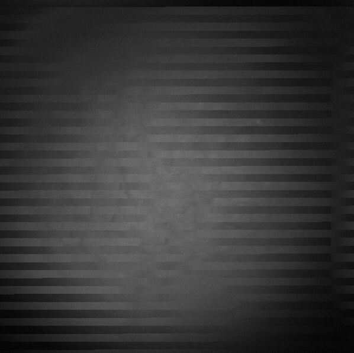
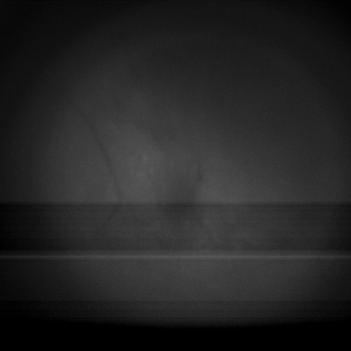
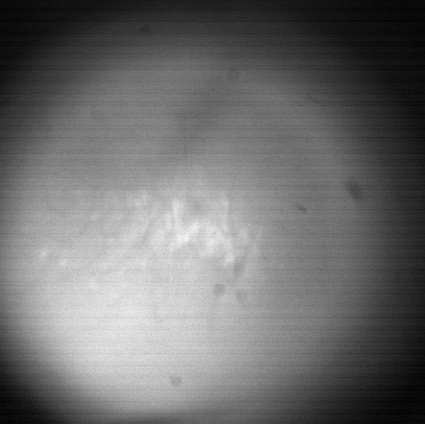

## Welcome to the UCLA Miniscope V4 Stripe Cleaner!

This jupyter notebook can be used to fix buffer mismatches that can occur when recording from the UCLA V4 Miniscope, allowing you to recover data you have collected. Stripes, as defined in this notebook, are any instance of vertical lines appearing in your Miniscope recording. There are multiple types of stripes that can occur during Miniscope recordings, and this notebook takes different approaches to fix or remove the different types. Below is a brief description of the types of striping we have observed during recordings.

Stable block stripes occur when the packets of data become misaligned during acquisition. They look like this:

**Thankfully, these are fixable!** By re-arranging the the data correctly, you can recover your field of view and will not have to lose any data. This is the main goal of this notebook.

Moving stripes, which are often thin horizontal lines that move rapidly along the field of view, are likely caused by electrical noise. They look something like this:

**These are not fixable.** In order to remove this noise from your recordings, you will either need to replace your coaxial cable, the button connecting to the PCB of the Miniscope, or the Miniscope PCB itself. There is a code block at the bottom of this notebook that you can use to replace those un-fixable frames with a previous frame without the moving stripes. Of course, if your whole recording has them, then it is impossible to remove them. Replacing with a previous good frame should only be done if it is a couple of frames of moving stripes (1-30 frames ideally for a 30 frames per second recording). Replacing multiple seconds may cause problems in the preprocessing pipeline of your choice, as it will introduce a large chunk of completely stable fluorescence (since the frame without stripes is being copied multiple times).

I hope that this notebook will be useful for saving already collected data. We've observed striping more often when there is a commutator involved and when there are large static-producing items in the room (such as curtains), so pay attention to these variables when running your experiments. Have fun Miniscoping!

The code included in this notebook was a cross-year collaborative effort that included code developed by Daniel Aharoni, William Mau, Zhe (Phil) Dong, Zach Pennington, Joe Zaki, and Austin Baggetta.